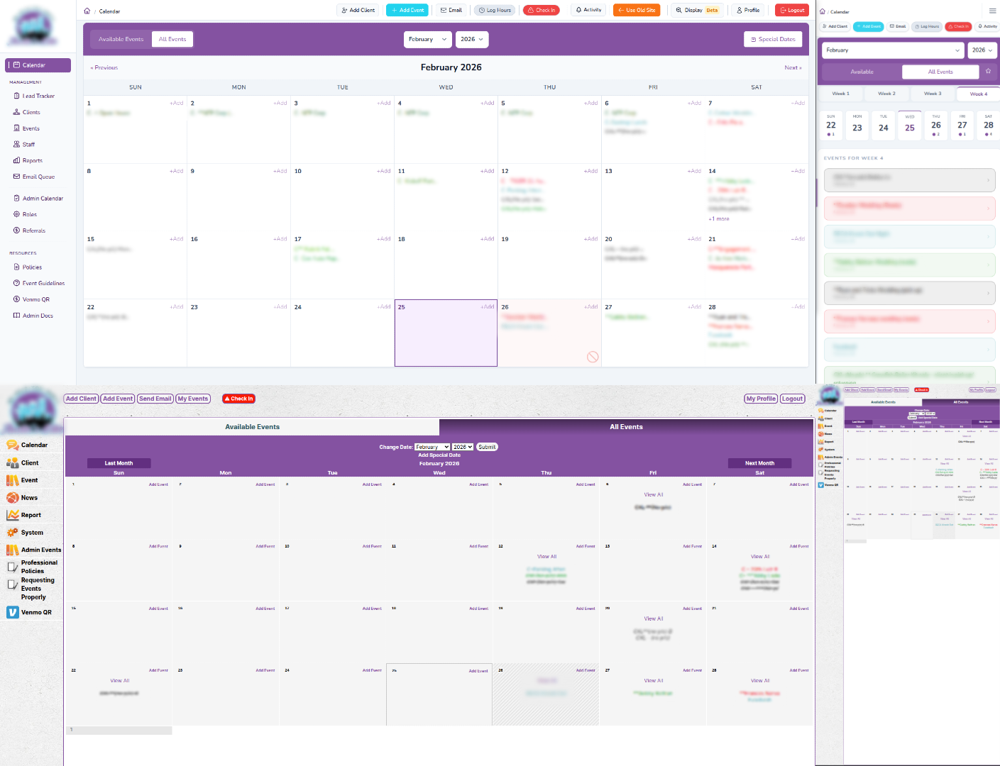
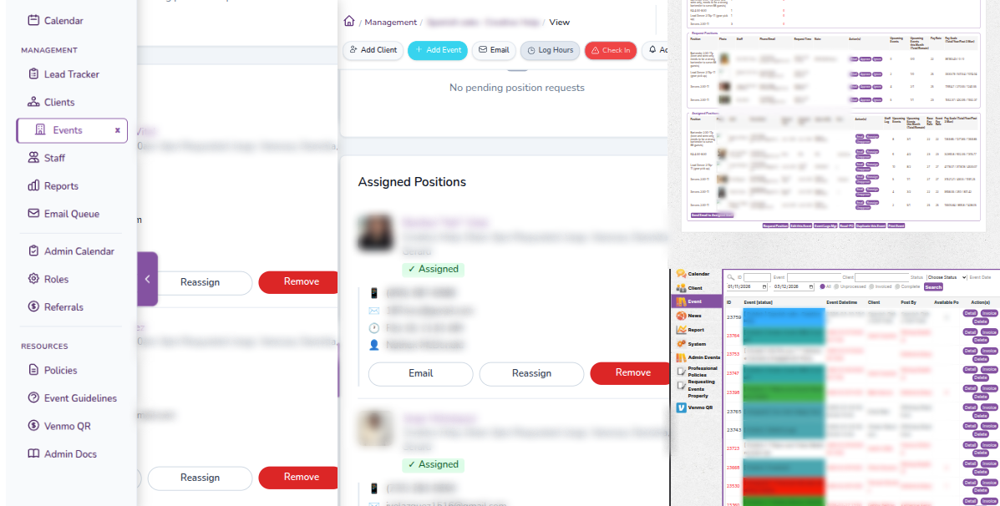

A few years ago, a friend called in a panic.

His boss ran a fully online staffing business, and the entire platform depended on a single developer: a Chinese expat who had built the system over many years. Then, suddenly, that developer had to return to China. No handoff, no documentation, no shared context.

Everything critical stayed behind in production code that nobody else understood.

I had been writing PHP since 2006, so I assumed this would be familiar territory. I expected legacy code. I did not expect the level of entropy waiting inside.

## The Reality of the Starting Point

The codebase was not just old. It was deeply fragile.

- The platform started as a shopping-cart script, then evolved into a staffing system through years of direct edits.
- Core files were copied and pasted across the app.
- Session, auth, permissions, rendering, and business rules were all mixed together.
- Variables and comments were partially in Chinese.
- There was no clear boundary between infrastructure and domain behavior.

And yet, the system worked. Hundreds of non-technical staff depended on it every day for scheduling, assignments, communication, and reporting.

That meant one thing: a full rewrite was not an option.

<figure>
  
  <figcaption>Legacy admin UI compared with the modernized experience.</figcaption>
</figure>

## The Constraint That Set the Tone

Two weeks into the project, the hosting provider announced end-of-support for older PHP versions. The live system had to move immediately or users would lose access.

So the first mission was survival: migrate infrastructure fast, stabilize runtime behavior, and protect continuity.

This shaped every technical decision after that.

## Strategy: Progressive Hybridization, Not Rewrite Theater

Instead of forcing framework purity, I introduced Laravel where it created immediate leverage and low operational risk.

### Where Laravel Added Value Early

- Routing and controller structure
- Eloquent models where data access was too repetitive
- Service and repository boundaries around critical workflows
- Blade templates/components for consistency and reuse

### What Stayed Legacy-Compatible on Purpose

- Native session behavior
- Existing permission model
- Data assumptions embedded in long-lived processes
- Request/response flows that business users relied on

The result was a deliberate hybrid architecture. Not pretty in a textbook sense, but stable, legible, and shippable.

## Migration Scale in Practice

The Git history over six months shows the pattern clearly:

| Month | Lines Touched | Added | Removed |
| --- | ---: | ---: | ---: |
| September 2025 | 243 | 199 | 44 |
| December 2025 | 907,675 | 358,837 | 548,838 |
| January 2026 | 44,449 | 31,430 | 13,019 |
| February 2026 | 5,693 | 4,334 | 1,359 |

Totals: **958,060 lines touched**, **394,800 added**, **563,260 removed**, and **168,460 fewer net lines**.

This is common in large legacy modernizations: one heavy structural phase, then hardening and incremental gains.

## Phase-by-Phase Execution

### 0) Stabilize the Runtime First

Before architecture changes, I made the code reliable on modern PHP (up through 8.3), removed obvious dead paths, and killed brittle compatibility hacks.

If runtime behavior is unstable, every later refactor becomes untrustworthy. This phase gave us a valid baseline.

### 1) Modernize High-Value Surfaces

I focused on high-traffic areas where maintenance pain was highest. Improving those first created immediate team benefit and funded the next wave of cleanup.

### 2) Write Hybrid Rules Explicitly

I documented what followed Laravel conventions and what must stay legacy-safe. That included session handling, request helpers, permissions, and architectural seams.

This prevented future regressions caused by well-intentioned but incorrect “full Laravel” assumptions.

### 3) Reorganize Structure at Scale

The hardest phase was moving legacy files into coherent app/resource structures, updating namespaces, rebuilding route mappings, and retiring or shimming old paths.

This is where migrations often fail from scope chaos. The key was disciplined sequencing, clear seams, and constant flow verification.

## Why Unpoly Was the Right Frontend Choice

I wanted a modern interface without introducing SPA-level client complexity.

Unpoly delivered:

- Server-rendered fragments
- Partial page updates
- Smoother navigation and modal interactions
- Backend-centric business logic

That improved UX substantially while keeping the security and reasoning model simple.

<figure>
  
  <figcaption>Modernized UI patterns made mobile usage significantly more usable.</figcaption>
</figure>

## Hard Parts That Needed Real Engineering

No legacy migration is smooth. The recurring failures were predictable:

- Route mismatches during path moves
- Fragment targeting issues in Unpoly flows
- Session/auth edge cases across old and new boundaries
- Legacy date/time assumptions hidden in scripts

The win was not “avoiding breakage.” The win was shortening the cycle:

1. Detect quickly
2. Isolate root cause
3. Apply minimal patch
4. Document the failure mode

That process compounding over time is what makes the migration sustainable.

## Testing for Legacy Truth, Not Theoretical Correctness

Unit tests alone were not enough. I built integration coverage against the real legacy schema and production-like data shapes.

That captured behavior quirks we would have missed in isolated tests and made refactoring materially safer.

## What This Migration Was Not

- Not a greenfield Laravel build
- Not a freeze on product development
- Not framework-purity theater
- Not a “replace everything first, validate later” rewrite

It was compatibility-first modernization with continuous delivery.

## Tradeoffs I Accepted

- Operational continuity over architectural purity
- Temporary coexistence of old and new patterns
- Slower broad cleanup in exchange for safer iteration
- Higher documentation overhead to keep team decisions aligned

Every one of these tradeoffs was intentional.

## Why This Worked

1. Compatibility was treated as a hard requirement.
2. Each phase delivered measurable value.
3. Hybrid boundaries were explicit and documented.
4. Unpoly modernized UX without frontend overreach.
5. Tests validated real historical behavior, not idealized behavior.

## Practical Guidance for Similar Projects

- Define “must not break” workflows before touching architecture.
- Stabilize runtime compatibility first.
- Prove the hybrid pattern in one high-value module.
- Establish helper conventions early.
- Prefer server-driven interactivity when SPA complexity is not justified.
- Test against real data patterns, not only synthetic fixtures.
- Keep a migration journal and retire failed experiments quickly.

## The Human Impact Is the Real Outcome

The biggest gain was not prettier code. It was organizational leverage:

- Developers stopped fearing critical modules.
- Onboarding became faster.
- Support issues dropped.
- Architecture conversations moved from reactive to strategic.

The system became easier to change safely, which is what modernization is actually for.

## Closing Thought

You do not need a full rewrite to modernize a long-lived platform.

You need disciplined sequencing, explicit boundaries, compatibility-first design, and a willingness to iterate in production reality.

This 15-year-old platform is now a Laravel + Unpoly hybrid that is faster to maintain, safer to extend, and more approachable for the team that depends on it.
